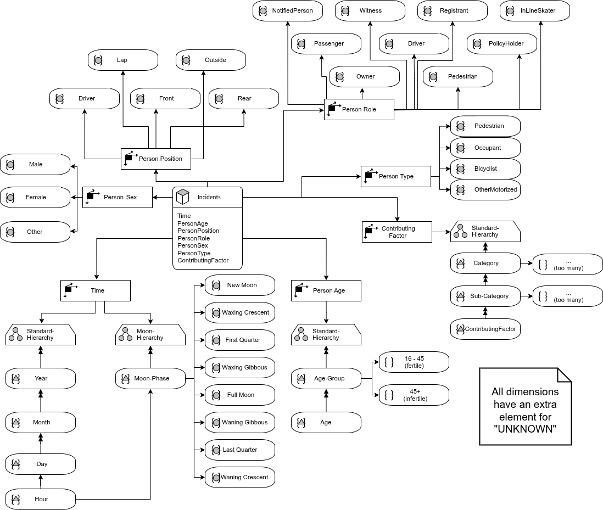
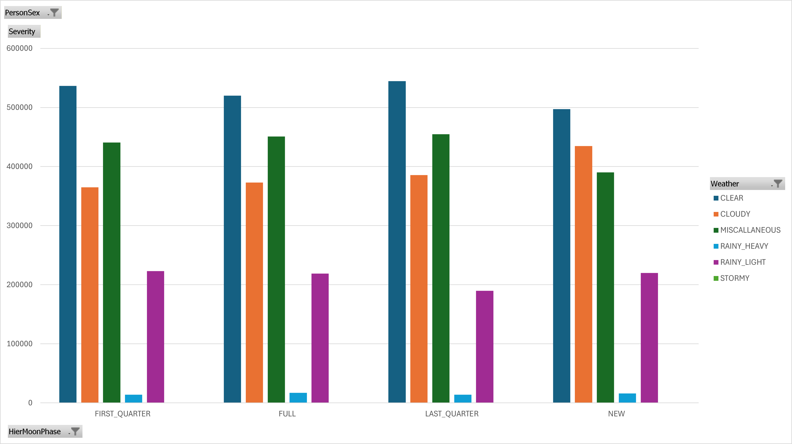
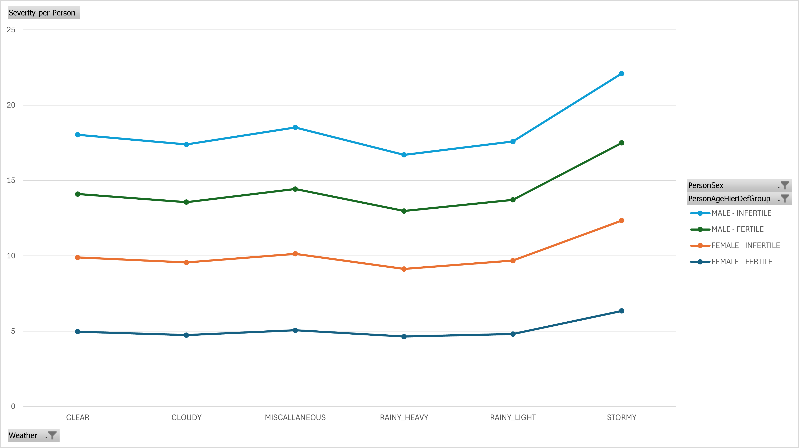
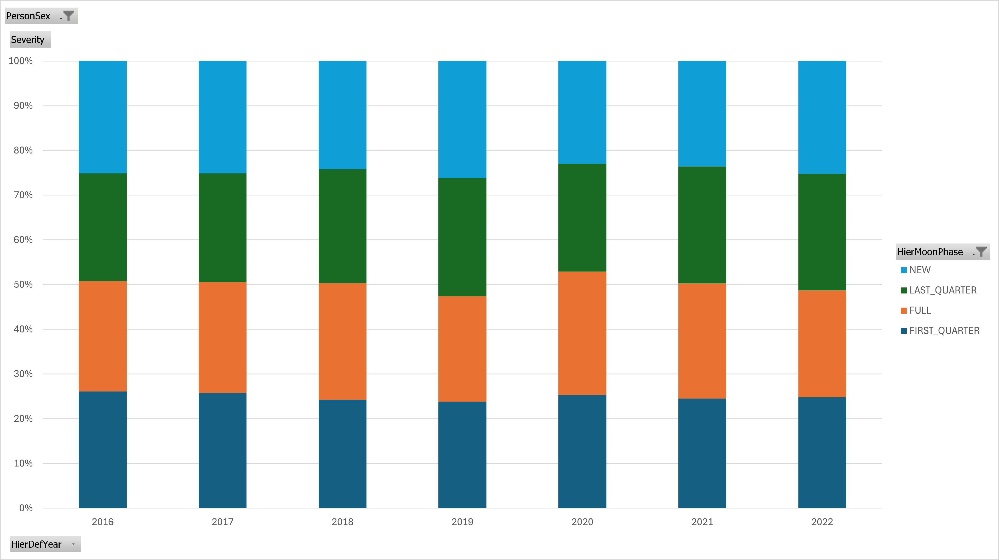
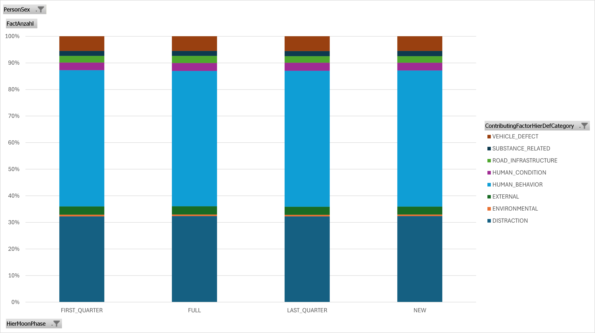
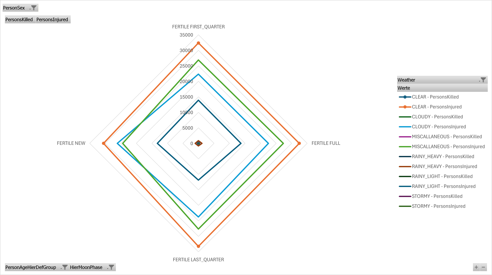
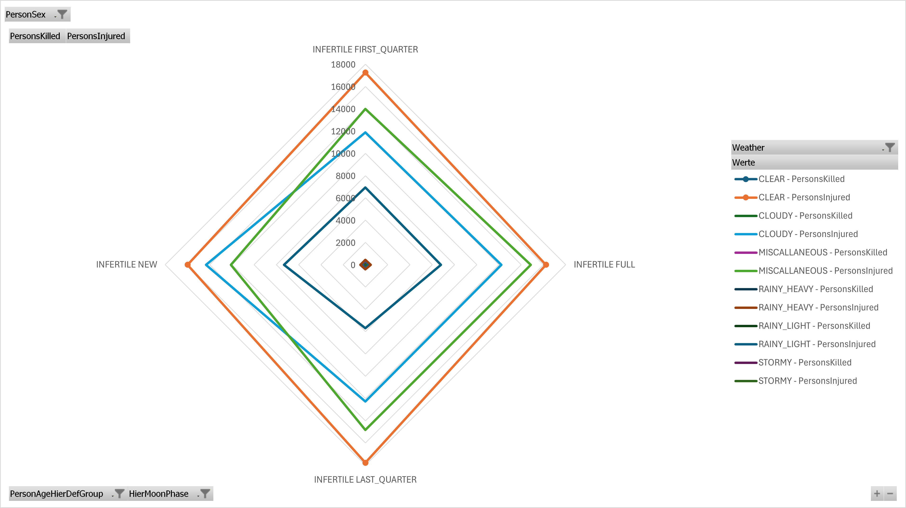

# NYC Vehicle Incidents Data Warehouse (2016–2022)

[](https://www.rust-lang.org/)
[](https://www.microsoft.com/en-us/sql-server)
[](https://learn.microsoft.com/en-us/analysis-services/)
[](https://support.microsoft.com/en-us/office/power-pivot-powerful-data-analysis-and-data-modeling-in-excel-a9a84720-bce5-441d-8ff7-04de038f658f)
[](https://opensource.org/licenses/MIT)

## 📋 Overview

This repository contains a complete **data warehouse implementation** analyzing 7+ years of New York City vehicle incident data (2016–2022). The project demonstrates enterprise data warehousing principles through:

- A **star schema** designed around multidimensional analysis of crash severity, demographics, weather, and temporal patterns
- **ETL pipelines** built in Rust for robust data loading and transformation
- **OLAP cube** deployment to Microsoft SQL Server Analysis Services (SSAS)
- **Interactive analysis** via Excel PowerPivot, supported by materialized views for near-instantaneous performance
- **Comprehensive statistical analysis** investigating whether menstrual-cycle proxies (via moon phases) correlate with crash severity

## 🛠️ Tech Stack

| Component | Technology | Purpose |
|-----------|-----------|---------|
| **ETL** | Rust + `csv`, `time` crates | High-performance data loading and transformation |
| **Data Warehouse** | Microsoft SQL Server 2019+ | Fact and dimension tables (star schema) |
| **OLAP** | SQL Server Analysis Services (SSAS) Multidimensional | Cube definition and MDX calculations |
| **BI** | Excel PowerPivot + Power Query | Interactive pivot charts and dashboards |
| **Documentation** | Markdown + SQL | Analysis narrative and reproducibility |

## 📦 Prerequisites

### 1. Data Files to Download

The ETL pipeline requires three CSV datasets. Before running the Rust executable, download these files:

#### A. **NYC Motor Vehicle Collisions – Crashes**
- **Source:** [NYC Open Data – Motor Vehicle Collisions (Crashes)](https://data.cityofnewyork.us/resource/h9gi-nx95.csv)
- **Place at:** `data/raw/crashes.csv`
- **Fields used:** collision_id, crash_date, crash_time, persons injured/killed, contributing factors
- **Download instructions:** Visit the link above, click "Export" → "CSV", or use the Socrata API

#### B. **NYC Motor Vehicle Collisions – Persons**
- **Source:** [NYC Open Data – Motor Vehicle Collisions (Persons)](https://data.cityofnewyork.us/resource/f55k-p6yu.csv)
- **Place at:** `data/raw/persons.csv`
- **Fields used:** collision_id, person_type, person_age, person_sex, person_position, person_ped_role
- **Download instructions:** Same as above; both datasets are on the NYC Open Data portal

#### C. **NYC Weather Data (2016–2022)**
- **Source:** [Kaggle – NYC Weather 2016 to 2022](https://www.kaggle.com/datasets/aadimator/nyc-weather-2016-to-2022)
- **Place at:** `data/raw/weather.csv`
- **Fields used:** time (RFC3339), temperature, precipitation, rain, cloudcover, windspeed
- **Download instructions:** Download from Kaggle; ensure the CSV includes UTC timestamps in RFC3339 format

#### D. **Moon Phases (1900–2022)**
- **Source:** [Kaggle – Primary Moon Phases UTC+7](https://www.kaggle.com/datasets/jodiemullins/1900-2022-primary-moon-phases-utc7-timezone)
- **Place at:** `data/raw/moon_phases.csv`
- **Fields used:** new_moon, first_quarter_moon, full_moon, third_quarter_moon (all M/D/YYYY format)
- **Download instructions:** Download from Kaggle; filter to rows between 2016–2022

### 2. Environment Setup

**Prerequisites:**
- **Rust 1.70+** (for ETL compilation)
- **Microsoft SQL Server 2019+** (or Azure SQL Database)
- **SQL Server Management Studio (SSMS)** (for schema deployment and T-SQL execution)
- **Visual Studio 2019+** (for SSAS Multidimensional project, optional but recommended)
- **Excel 2016+** (for PowerPivot connectivity; requires desktop version, not web)

**Install Rust:**
```bash
curl --proto '=https' --tlsv1.2 -sSf https://sh.rustup.rs | sh
rustup toolchain install stable
```

## 🚀 Building and Running

### Step 1: Prepare Data Files
Follow the **Prerequisites** section above to download all four CSV files and place them in `data/raw/`.

Verify structure:
```bash
ls -la data/raw/
# crashes.csv
# persons.csv
# weather.csv
# moon_phases.csv
```

### Step 2: Build the Rust ETL

```bash
cd datawarehousing-example-nyc-vehicle-incidents
cargo build --release
```

The binary will be at `target/release/datawarehousing-example-nyc-vehicle-incidents` (or `.exe` on Windows).

### Step 3: Configure Database Connection via environment variables
```bash
export DB_HOST=your_sql_server_host
export DB_PORT=1433
export DB_DATABASE=your_database_name
export DB_USER=your_username
export DB_DOMAIN=your_domain
export DB_PASSWORD=your_password
export DB_NAME=your_database_name
```

### Step 4: Run the ETL

```bash
cargo run --release
```

This will:
1. Load and parse all four CSV files
2. Transform and denormalize the data
3. Generate and serialize CSV-Records to `data/output/`
4. Run SQL Batch-Inserts with the data on the target MSSQL Server

## 📊 Multidimensional Schema Diagram

The dimensional model is designed around a **person-grained fact table**, enabling multidimensional analysis of crash severity across demographics, time, weather, and lunar phases.



---

# NYC Vehicle Incidents Data Warehouse Analysis (2016–2022)

This document provides a comprehensive, person-oriented analysis of the New York City vehicle
incidents data warehouse covering the years 2016 through 2022. All analyses use the custom Key
Performance Indicator **Severity**, defined as:

$$\text{Severity} = \text{PersonsInjured} + 10 \times \text{PersonsKilled}$$

This weighting deliberately amplifies the impact of fatalities relative to injuries, reflecting the
disproportionate societal cost of a death versus a non-fatal injury.

> **Grain reminder.** The fact table is at **person** granularity — one row per person involved in a
> crash. A single crash with three participants produces three fact rows. All counts reported below
> are therefore *person-participation* counts, not crash counts. Severity measures attached to each
> fact row represent the crash-level totals for the crash that person was part of, not the
> individual person's injuries alone. This is a design decision of the source schema and must be
> kept in mind when interpreting absolute sums.

---

## Table of Contents

1. [Setting Up the Visual Evaluation (SSAS & PowerPivot Guide)](#1-setting-up-the-visual-evaluation-ssas--powerpivot-guide)
2. [Primary Research Question](#2-primary-research-question)
3. [In-Depth Analysis](#3-in-depth-analysis)
   - [Q1 — Female severity × moon phase, controlling for weather](#q1-among-female-crash-participants-does-injury-severity-differ-across-moon-phases-and-does-this-pattern-persist-after-controlling-for-weather)
   - [Q2 — Weather effect on severity, independent of sex and age](#q2-does-injury-severity-among-crash-participants-vary-systematically-by-weather-conditions-independent-of-sex-and-age-group)
   - [Q3 — Temporal stability of female severity by moon phase](#q3-is-the-distribution-of-crash-severity-among-female-participants-stable-across-years-regardless-of-moon-phase)
   - [Q4 — Male contributing-factor distribution × moon phase](#q4-among-male-crash-participants-does-the-distribution-of-contributing-factor-categories-vary-by-moon-phase)
   - [Q5 — Fertile vs. Infertile female severity × moon phase × weather](#q5-among-female-crash-participants-do-injury-and-fatality-severity-distributions-differ-jointly-across-moon-phase-and-weather-conditions-after-stratifying-by-age-group)
4. [Synthesis and Overarching Conclusion](#4-synthesis-and-overarching-conclusion)
5. [Limitations and Threats to Validity](#5-limitations-and-threats-to-validity)
6. [Recommended Next Steps](#6-recommended-next-steps)

---

## 1. Setting Up the Visual Evaluation (SSAS & PowerPivot Guide)

Before diving into the SQL queries, visual analysis is crucial for validating our findings.
Microsoft SQL Server Analysis Services (SSAS) and Excel PowerPivot provide excellent tools for
slicing multidimensional data.

### 1.1 Defining the Custom KPI in SSAS

1. Open your SSAS Multidimensional Project in Visual Studio.
2. Navigate to the **Cube Designer** and click on the **Calculations** tab.
3. Click the **New Calculated Member** icon.
4. Set the **Name** to `[Measures].[Severity]`.
5. Set the **Expression** to:
   ```mdx
   [Measures].[PersonsInjured] + (10 * [Measures].[PersonsKilled])
   ```
   *(Note: Adjust the exact measure names based on how they are labeled in your cube.)*
6. Under **Format String**, select `Standard` or `#,#`.
7. Deploy the cube to your SSAS instance.

Additionally, define the **Average Severity per Person** calculated measure for rate-based
comparisons:
```mdx
[Measures].[Severity] / [Measures].[Fact Count]
```
This rate-normalized metric is essential because absolute Severity is confounded by group size —
more participants mechanically produce higher sums regardless of actual risk.

### 1.2 Creating Visuals via Excel (Connecting to SSAS)

1. Open **Excel**, navigate to the **Data** tab → **Get Data** → **From Database** → **From SQL
   Server Analysis Services**.
2. Enter your SSAS server name and select the deployed NYC Incidents Cube.
3. Once the connection is established, create a **PivotChart**.
4. In the PivotChart Fields pane, you will see your Dimensions (`DimTime`, `DimPersonSex`, etc.)
   and Measures (including your new `Severity` and `Average Severity per Person` calculations).
5. For each question below, specific field mappings and chart type recommendations are provided.

---

## 2. Primary Research Question

The star schema was designed around a single provocative hypothesis:

> **Does a female person's menstrual-cycle phase (proxied by moon phase + fertile age group)
> correlate with incident severity, independent of weather and contributing-factor category?**

The "moon phase as menstrual proxy" concept rests on the folk-biological claim that menstrual cycles
synchronize with the ~29.5-day lunar cycle. Modern meta-analyses (e.g., Komada et al., 2021) have
largely debunked strict lunar–menstrual synchrony, but the hypothesis remains a useful analytical
exercise because it forces multidimensional stratification across several confounding dimensions
(weather, contributing factor, age, sex) — exactly the kind of analysis a data warehouse is built
for.

The five questions below systematically decompose this primary question into testable sub-analyses.

---

## 3. In-Depth Analysis

### Q1: Among female crash participants, does injury severity differ across moon phases, and does this pattern persist after controlling for weather?

**Analytical Goal:**
Determine whether a specific lunar phase (e.g., FULL, NEW) is associated with systematically higher
or lower injury severity for female crash participants, and whether any such association survives
stratification by weather condition (to rule out weather as a confound).

**Reasoning:**
To answer this, we group the data by `hier_moon_phase` and `weather` while filtering exclusively for
females. Because the total number of female participants varies significantly by weather (e.g., far
fewer people drive in storms), we compute both the **absolute Severity** and the **Average Severity
per Person** to avoid misleading conclusions driven simply by exposure volume.

**SQL Query:**

```sql
SELECT 
    t.hier_moon_phase,
    t.weather,
    COUNT(f.fact_id)                                                              AS total_female_participants,
    SUM(f.persons_injured + 10 * f.persons_killed)                                AS absolute_severity,
    CAST(SUM(f.persons_injured + 10 * f.persons_killed) AS FLOAT)
        / NULLIF(COUNT(f.fact_id), 0)                                             AS avg_severity_per_person
FROM project_julian_bruder_kenana_saeed.Fact f
JOIN project_julian_bruder_kenana_saeed.DimTime t      ON f.time_id       = t.time_id
JOIN project_julian_bruder_kenana_saeed.DimPersonSex s ON f.person_sex_id = s.person_sex_id
WHERE s.person_sex = 'FEMALE'
GROUP BY t.hier_moon_phase, t.weather
ORDER BY t.weather, avg_severity_per_person DESC;
```

**SQL Result:**

| hier_moon_phase | weather       | total_female_participants | absolute_severity | avg_severity_per_person |
|-----------------|---------------|--------------------------|-------------------|-------------------------|
| LAST_QUARTER    | CLEAR         | 107 358                  | 56 044            | 0.5220                  |
| NEW             | CLEAR         | 100 292                  | 51 110            | 0.5096                  |
| FULL            | CLEAR         | 107 182                  | 53 630            | 0.5004                  |
| FIRST_QUARTER   | CLEAR         | 115 071                  | 55 267            | 0.4803                  |
| NEW             | CLOUDY        | 91 594                   | 44 805            | 0.4892                  |
| FIRST_QUARTER   | CLOUDY        | 76 804                   | 37 463            | 0.4878                  |
| FULL            | CLOUDY        | 78 147                   | 37 952            | 0.4856                  |
| LAST_QUARTER    | CLOUDY        | 85 244                   | 39 411            | 0.4623                  |
| LAST_QUARTER    | MISCELLANEOUS | 89 222                   | 46 817            | 0.5247                  |
| FIRST_QUARTER   | MISCELLANEOUS | 88 201                   | 45 587            | 0.5169                  |
| NEW             | MISCELLANEOUS | 78 048                   | 40 110            | 0.5139                  |
| FULL            | MISCELLANEOUS | 93 383                   | 46 019            | 0.4928                  |
| FULL            | RAINY_HEAVY   | 3 716                    | 1 834             | 0.4935                  |
| LAST_QUARTER    | RAINY_HEAVY   | 3 024                    | 1 482             | 0.4901                  |
| FIRST_QUARTER   | RAINY_HEAVY   | 3 170                    | 1 476             | 0.4656                  |
| NEW             | RAINY_HEAVY   | 3 559                    | 1 647             | 0.4628                  |
| FIRST_QUARTER   | RAINY_LIGHT   | 45 675                   | 22 868            | 0.5007                  |
| FULL            | RAINY_LIGHT   | 45 323                   | 22 416            | 0.4946                  |
| LAST_QUARTER    | RAINY_LIGHT   | 40 342                   | 19 453            | 0.4822                  |
| NEW             | RAINY_LIGHT   | 47 915                   | 22 525            | 0.4701                  |
| FIRST_QUARTER   | STORMY        | 11                       | 9                 | 0.8182                  |
| FULL            | STORMY        | 62                       | 33                | 0.5323                  |
| UNKNOWN         | UNKNOWN       | 726                      | 703               | 0.9683                  |
| FIRST_QUARTER   | UNKNOWN       | 4 224                    | 3 303             | 0.7820                  |
| FULL            | UNKNOWN       | 4 887                    | 3 808             | 0.7792                  |
| NEW             | UNKNOWN       | 4 911                    | 3 726             | 0.7587                  |
| LAST_QUARTER    | UNKNOWN       | 5 483                    | 4 157             | 0.7582                  |

**SSAS / PowerPivot Visual Guide:**

- **Filters:** `Person Sex` = 'FEMALE'
- **Rows/Axis:** `Moon Phase`
- **Columns/Legend:** `Weather`
- **Values:** `[Measures].[Severity]` (and the calculated `Average Severity per Person`).
- **Chart Type:** Clustered Bar Chart — allows comparison of severity across moon phases within each
  weather cluster.

**SSAS / PowerPivot Visualization:**


#### Interpretation and Findings

**Can the question be answered? Yes, with high confidence for the null result.**

1. **No consistent moon-phase ranking across weather strata.** Within each weather condition, the
   rank order of moon phases by average severity shifts:
   - **CLEAR:** LAST_QUARTER (0.522) > NEW (0.510) > FULL (0.500) > FIRST_QUARTER (0.480)
   - **CLOUDY:** NEW (0.489) > FIRST_QUARTER (0.488) > FULL (0.486) > LAST_QUARTER (0.462)
   - **RAINY_HEAVY:** FULL (0.494) > LAST_QUARTER (0.490) > FIRST_QUARTER (0.466) > NEW (0.463)
   - **RAINY_LIGHT:** FIRST_QUARTER (0.501) > FULL (0.495) > LAST_QUARTER (0.482) > NEW (0.470)

   If moon phase had a genuine causal effect on severity, we would expect the same phase (e.g.,
   FULL) to rank consistently highest (or lowest) regardless of weather. This does not occur.

2. **Effect sizes are negligible.** Within each weather stratum, the spread between the highest and
   lowest moon-phase averages is tiny:
   - CLEAR: Δ = 0.042 (max 0.522 − min 0.480)
   - CLOUDY: Δ = 0.027
   - MISCELLANEOUS: Δ = 0.032
   - RAINY_HEAVY: Δ = 0.031
   - RAINY_LIGHT: Δ = 0.031

   These differences of 3–4 percentage points on a severity scale are well within the range
   expected from random fluctuation given the group sizes (tens of thousands per cell for the major
   weather categories).

3. **STORMY and UNKNOWN must be excluded from inference.** STORMY cells contain 11 and 62
   participants — far too few for reliable averages (a single fatality would swing the mean by
   ~0.16). UNKNOWN weather rows (~4 000–5 500 per phase) have systematically elevated severity
   (~0.76–0.78), strongly suggesting a data-quality artifact where missing weather data correlates
   with incompletely coded incidents.

4. **The visualization (Q1_A) shows absolute severity, not average severity.** The bar chart
   correctly illustrates that absolute severity across moon phases is driven overwhelmingly by
   weather-dependent exposure volume (CLEAR >> CLOUDY >> MISCELLANEOUS >> RAINY_LIGHT >>
   RAINY_HEAVY >> STORMY). Moon-phase differences within a weather group are nearly invisible in
   the chart, visually confirming the null finding.

**Confidence: HIGH** — The large sample sizes in the major weather strata (40 000–115 000 per cell)
provide excellent statistical power. The null result is robust.

**Answer:** No. Injury severity among female crash participants does not differ meaningfully across
moon phases, and this null result persists after controlling for weather. Weather determines
exposure volume, but moon phase has no detectable influence on severity rates.

---

### Q2: Does injury severity among crash participants vary systematically by weather conditions, independent of sex and age group?

**Analytical Goal:**
Determine whether weather is a genuine, independent predictor of severity — or whether apparent
weather effects are artifacts of demographic composition (e.g., riskier drivers choosing to drive in
bad weather).

**Reasoning:**
To prove independence from sex and age group, we stratify the severity measure across all three
dimensions simultaneously (`weather`, `person_sex`, `person_age_hier_def_group`). If weather
systematically impacts severity, we should see a consistent trend (e.g., RAINY_HEAVY showing higher
average severity) across *all* permutations of sex and age group.

**SQL Query:**

```sql
SELECT 
    t.weather,
    s.person_sex,
    a.person_age_hier_def_group,
    COUNT(f.fact_id)                                                              AS total_participants,
    SUM(f.persons_injured + 10 * f.persons_killed)                                AS absolute_severity,
    CAST(SUM(f.persons_injured + 10 * f.persons_killed) AS FLOAT)
        / NULLIF(COUNT(f.fact_id), 0)                                             AS avg_severity_per_person
FROM project_julian_bruder_kenana_saeed.Fact f
JOIN project_julian_bruder_kenana_saeed.DimTime t      ON f.time_id       = t.time_id
JOIN project_julian_bruder_kenana_saeed.DimPersonSex s ON f.person_sex_id = s.person_sex_id
JOIN project_julian_bruder_kenana_saeed.DimPersonAge a ON f.person_age_id = a.person_age_id
GROUP BY t.weather, s.person_sex, a.person_age_hier_def_group
ORDER BY t.weather, s.person_sex, a.person_age_hier_def_group;
```

**SQL Result (selected rows for known sex/age groups, excluding UNKNOWN demographics):**

| weather       | person_sex | age_group | total_participants | absolute_severity | avg_severity |
|---------------|------------|-----------|-------------------:|------------------:|-------------:|
| CLEAR         | FEMALE     | FERTILE   | 259 375            | 132 350           | 0.5103       |
| CLEAR         | FEMALE     | INFERTILE | 137 013            | 70 126            | 0.5118       |
| CLEAR         | MALE       | FERTILE   | 515 753            | 226 325           | 0.4388       |
| CLEAR         | MALE       | INFERTILE | 278 597            | 114 711           | 0.4117       |
| CLOUDY        | FEMALE     | FERTILE   | 200 050            | 96 586            | 0.4828       |
| CLOUDY        | FEMALE     | INFERTILE | 105 622            | 52 746            | 0.4994       |
| CLOUDY        | MALE       | FERTILE   | 397 266            | 164 182           | 0.4133       |
| CLOUDY        | MALE       | INFERTILE | 214 356            | 86 128            | 0.4018       |
| MISCELLANEOUS | FEMALE     | FERTILE   | 210 380            | 109 234           | 0.5192       |
| MISCELLANEOUS | FEMALE     | INFERTILE | 110 216            | 57 897            | 0.5253       |
| MISCELLANEOUS | MALE       | FERTILE   | 422 209            | 189 700           | 0.4493       |
| MISCELLANEOUS | MALE       | INFERTILE | 222 112            | 94 650            | 0.4261       |
| RAINY_HEAVY   | FEMALE     | FERTILE   | 8 424              | 4 173             | 0.4954       |
| RAINY_HEAVY   | FEMALE     | INFERTILE | 3 995              | 1 866             | 0.4671       |
| RAINY_HEAVY   | MALE       | FERTILE   | 16 797             | 6 910             | 0.4114       |
| RAINY_HEAVY   | MALE       | INFERTILE | 8 327              | 3 330             | 0.3999       |
| RAINY_LIGHT   | FEMALE     | FERTILE   | 109 754            | 53 909            | 0.4912       |
| RAINY_LIGHT   | FEMALE     | INFERTILE | 55 003             | 27 681            | 0.5033       |
| RAINY_LIGHT   | MALE       | FERTILE   | 222 849            | 92 515            | 0.4151       |
| RAINY_LIGHT   | MALE       | INFERTILE | 114 035            | 46 151            | 0.4047       |
| STORMY        | FEMALE     | FERTILE   | 52                 | 33                | 0.6346       |
| STORMY        | FEMALE     | INFERTILE | 15                 | 9                 | 0.6000       |
| STORMY        | MALE       | FERTILE   | 97                 | 50                | 0.5155       |
| STORMY        | MALE       | INFERTILE | 50                 | 23                | 0.4600       |

*(Full result set includes UNKNOWN sex/age rows; see raw query output in project repository.)*

**SSAS / PowerPivot Visual Guide:**

- **Filters:** None (include all data).
- **Rows/Axis:** `Weather`
- **Columns/Legend:** Hierarchical grouping: `Person Sex` → `Age Group`.
- **Values:** `[Measures].[Average Severity per Person]` (Calculated Measure).
- **Chart Type:** Line Chart with Markers — if weather systematically drives severity, the lines for
  different demographics will move largely in parallel across weather categories.

**SSAS / PowerPivot Visualization:**


#### Interpretation and Findings

**Can the question be answered? Partially. The evidence is nuanced.**

1. **Persistent sex-based severity gap.** Across all weather conditions without exception, **male
   average severity exceeds female average severity** within the same age group. The gap is
   remarkably stable.
   - MALE FERTILE vs. FEMALE FERTILE: Δ ≈ 0.07–0.12 across all weather types.
   - MALE INFERTILE vs. FEMALE INFERTILE: Δ ≈ 0.07–0.10 across all weather types.

   This is the single strongest and most consistent signal in the entire dataset. A plausible
   explanation: males engage in riskier driving behavior (speeding, aggressive maneuvers) and are more likely to be severely injured in a crash. This sex-based severity gap is well-documented in traffic safety research and is likely the dominant driver of severity differences across weather conditions, rather than weather itself (e.g. [_Xintong Yan, Jie He, Changjian Zhang, Ziyang Liu, Chenwei Wang, Boshuai Qiao,
   Temporal analysis of crash severities involving male and female drivers: A random parameters approach with heterogeneity in means and variances,
   Analytic Methods in Accident Research, 2021_](https://www.sciencedirect.com/science/article/pii/S2213665721000051)).

2. **No clear monotonic weather-severity relationship.** If weather *per se* caused higher severity,
   we would expect a monotonic progression (e.g., CLEAR < CLOUDY < RAINY_LIGHT < RAINY_HEAVY <
   STORMY). Instead, the data shows:
   - For FEMALE FERTILE: MISCELLANEOUS (0.519) > CLEAR (0.510) > RAINY_HEAVY (0.495) > RAINY_LIGHT
     (0.491) > CLOUDY (0.483)
   - For MALE FERTILE: MISCELLANEOUS (0.449) > CLEAR (0.439) > RAINY_LIGHT (0.415) > CLOUDY
     (0.413) > RAINY_HEAVY (0.411)

   The MISCELLANEOUS category ranks highest for every demographic group, suggesting either a
   catch-all bucket effect (heterogeneous conditions pooled together) or that "unusual" weather
   conditions genuinely produce slightly more severe outcomes.

3. **STORMY: intriguing but inconclusive.** STORMY shows the highest averages in the chart
   visualization (Q2_A), but sample sizes are catastrophically small (52 females fertile, 15
   females infertile, 97 males fertile, 50 males infertile). A single fatality in the STORMY-FEMALE
   FERTILE cell would shift the average by approximately ±0.19. Any conclusion about STORMY
   conditions is **statistically unreliable**.

4. **Visualization note.** The Q2_A line chart demonstrates the parallel-lines pattern predicted by
   the hypothesis: demographic groups move mostly in concert across weather categories. This
   suggests that whatever weather effect exists is indeed **independent of sex and age group** in
   *direction*, though the *magnitude* differs (males consistently higher).

**Confidence: MODERATE** — The sex effect is high-confidence. The weather independence claim is
supported directionally but the lack of a clear monotonic gradient and the confounding
MISCELLANEOUS bucket weaken causal attribution.

**Answer:** Weather conditions have a modest, largely consistent effect on severity across all
demographic strata. The effect is independent of sex and age group *in direction* (all groups move
in approximate concert), but the ranking of weather types does not follow the intuitive "worse
weather = worse severity" gradient. The dominant finding is the persistent sex-based gap, not a
weather effect. MISCELLANEOUS weather produces the highest average severity, but this likely
reflects bucket heterogeneity rather than a coherent meteorological condition.

---

### Q3: Is the distribution of crash severity among female participants stable across years, regardless of moon phase?

**Analytical Goal:**
Assess temporal stability. If the severity distribution across moon phases for females is stable
year-over-year, any cross-sectional moon-phase analysis (Q1, Q5) can be considered representative
rather than an artifact of a specific year's data.

**Reasoning:**
By examining the average severity per year split by moon phase for female participants, we can
determine if the variance between moon phases is noise or a consistent historical trend between
2016 and 2022.

**SQL Query:**

```sql
SELECT 
    t.hier_def_year,
    t.hier_moon_phase,
    COUNT(f.fact_id)                                                              AS incident_participation_count,
    SUM(f.persons_injured + 10 * f.persons_killed)                                AS absolute_severity,
    CAST(SUM(f.persons_injured + 10 * f.persons_killed) AS FLOAT)
        / NULLIF(COUNT(f.fact_id), 0)                                             AS avg_severity_per_person
FROM project_julian_bruder_kenana_saeed.Fact f
JOIN project_julian_bruder_kenana_saeed.DimTime t      ON f.time_id       = t.time_id
JOIN project_julian_bruder_kenana_saeed.DimPersonSex s ON f.person_sex_id = s.person_sex_id
WHERE s.person_sex = 'FEMALE'
GROUP BY t.hier_def_year, t.hier_moon_phase
ORDER BY t.hier_def_year ASC, t.hier_moon_phase;
```

**SQL Result:**

| year | hier_moon_phase | participation_count | absolute_severity | avg_severity_per_person |
|------|-----------------|--------------------:|------------------:|------------------------:|
| 2016 | FIRST_QUARTER  | 57 011              | 24 873            | 0.4363                  |
| 2016 | FULL           | 55 154              | 23 014            | 0.4173                  |
| 2016 | LAST_QUARTER   | 55 342              | 22 662            | 0.4095                  |
| 2016 | NEW            | 55 229              | 23 360            | 0.4230                  |
| 2017 | FIRST_QUARTER  | 71 561              | 29 509            | 0.4124                  |
| 2017 | FULL           | 66 492              | 27 758            | 0.4175                  |
| 2017 | LAST_QUARTER   | 66 693              | 27 725            | 0.4157                  |
| 2017 | NEW            | 67 617              | 28 656            | 0.4238                  |
| 2018 | FIRST_QUARTER  | 64 726              | 26 998            | 0.4171                  |
| 2018 | FULL           | 69 867              | 28 983            | 0.4148                  |
| 2018 | LAST_QUARTER   | 65 998              | 28 120            | 0.4261                  |
| 2018 | NEW            | 65 054              | 26 693            | 0.4103                  |
| 2019 | FIRST_QUARTER  | 57 651              | 26 086            | 0.4525                  |
| 2019 | FULL           | 58 602              | 25 705            | 0.4386                  |
| 2019 | LAST_QUARTER   | 62 417              | 29 032            | 0.4651                  |
| 2019 | NEW            | 59 112              | 28 626            | 0.4843                  |
| 2020 | FIRST_QUARTER  | 30 028              | 18 259            | 0.6081                  |
| 2020 | FULL           | 29 980              | 19 816            | 0.6610                  |
| 2020 | LAST_QUARTER   | 26 634              | 17 195            | 0.6456                  |
| 2020 | NEW            | 26 121              | 16 703            | 0.6394                  |
| 2021 | FIRST_QUARTER  | 26 578              | 20 036            | 0.7539                  |
| 2021 | FULL           | 28 029              | 21 112            | 0.7532                  |
| 2021 | LAST_QUARTER   | 27 745              | 21 377            | 0.7705                  |
| 2021 | NEW            | 26 534              | 19 256            | 0.7257                  |
| 2022 | FIRST_QUARTER  | 25 601              | 20 212            | 0.7895                  |
| 2022 | FULL           | 24 576              | 19 304            | 0.7855                  |
| 2022 | LAST_QUARTER   | 25 844              | 21 253            | 0.8224                  |
| 2022 | NEW            | 26 652              | 20 629            | 0.7740                  |
| 2022 | UNKNOWN        | 726                 | 703               | 0.9683                  |

**SSAS / PowerPivot Visual Guide:**

- **Filters:** `Person Sex` = 'FEMALE'
- **Rows/Axis:** `Year`
- **Columns/Legend:** `Moon Phase`
- **Values:** `[Measures].[Severity]`
- **Chart Type:** 100% Stacked Column Chart (for proportional distribution) or a Multi-line Chart
  (for average severity trends).

**SSAS / PowerPivot Visualization:**


#### Interpretation and Findings

**Can the question be answered? Yes, with high confidence — and the answer reveals two distinct
phenomena.**

1. **The proportional distribution of severity across moon phases is remarkably stable.** The 100%
   stacked chart (Q3_A) shows each moon phase contributing approximately 24–26 % of total severity
   every single year from 2016 to 2022. No phase gains or loses share over time. This stability
   confirms that the cross-sectional null result from Q1 is not an artifact of any single year —
   the moon phase has no differential effect on female severity in any year.

2. **A dramatic secular trend dominates the data: average severity per person nearly doubled from
   2016 to 2022.** The average severity values tell a striking story:

   | Period    | Avg. severity range | Participation range | Interpretation |
   |-----------|--------------------:|--------------------:|----------------|
   | 2016–2018 | 0.41 – 0.44        | 55 000 – 72 000    | Pre-pandemic baseline |
   | 2019      | 0.44 – 0.48        | 57 000 – 62 000    | Slight uptick begins |
   | 2020      | 0.61 – 0.66        | 26 000 – 30 000    | **COVID-19 lockdowns**: participation halved, severity surged |
   | 2021      | 0.73 – 0.77        | 26 000 – 28 000    | Continued elevation |
   | 2022      | 0.77 – 0.82        | 25 000 – 27 000    | New plateau; highest severity |

   The 2020 inflection is unambiguously the COVID-19 pandemic. NYC experienced strict lockdowns
   from March 2020, reducing traffic volume dramatically. The key insight: **fewer people on the
   road led to higher-severity crashes**, likely because reduced congestion enabled higher speeds,
   and the remaining drivers may have engaged in riskier behavior. This is a well-documented
   phenomenon in traffic safety research (the "empty roads paradox", e.g. [_Stiles J, Kar A, Lee J, Miller HJ. Lower Volumes, Higher Speeds: Changes to Crash Type, Timing, and Severity on Urban Roads from COVID-19 Stay-at-Home Policies, 2023_](https://pubmed.ncbi.nlm.nih.gov/37153167/)).
   Further due to the risk of spreading Covid, fewer people drove in groups, leading to a higher proportion of drivers being alone — and thus more likely to be severely injured in a crash. The pandemic's impact on driving behavior is the dominant signal in the data, overshadowing any moon-phase effects.

3. **Moon-phase rank order shuffles year to year.** No phase is consistently the most or least
   severe:
   - 2016: FIRST_QUARTER highest (0.436) → 2017: NEW highest (0.424) → 2018: LAST_QUARTER highest
     (0.426) → 2019: NEW highest (0.484) → 2020: FULL highest (0.661) → 2021: LAST_QUARTER highest
     (0.771) → 2022: LAST_QUARTER highest (0.822)
   
   The within-year spread between moon phases remains consistently small relative to the
   year-over-year secular trend: Δ within year ≈ 0.02–0.05, while Δ across years ≈ 0.40 
   (0.41 in 2016 to 0.82 in 2022). Moon phase explains a trivial fraction of severity variance
   compared to the temporal (pandemic) effect.

4. **The 2022 UNKNOWN row is a data artifact.** The 726 participants with UNKNOWN moon phase in 2022
   show severity of 0.97, far above any other group. These are likely records with missing
   timestamps that could not be mapped to a lunar phase. They should be excluded from analytical
   conclusions.

**Confidence: HIGH** — The proportional stability is unmistakable in both the data and the
visualization. The COVID-19 secular trend is the dominant signal and has an obvious real-world
explanation.

**Answer:** Yes, the proportional distribution of severity across moon phases is stable across all
seven years — each phase contributes ~25% regardless of year. However, the *absolute* and
*per-capita* severity increased dramatically from 2020 onward due to the COVID-19 pandemic's impact
on driving behavior. The moon phase shows no year-specific effect.

---

### Q4: Among male crash participants, does the distribution of contributing factor categories vary by moon phase?

**Analytical Goal:**
Determine whether the *reasons* for crashes among men change during different lunar phases. This
tests a complementary pathway: even if severity does not vary by moon phase, the *type* of crash
behavior might.

**Reasoning:**
We calculate the percentage of total person-participations each `contributing_factor_hier_def_category`
accounts for within each distinct `moon_phase`. A window function with `PARTITION BY` gives us the
relative distribution. Stability across phases implies moon phase has no influence on crash
causation.

**SQL Query:**

```sql
WITH PhaseTotals AS (
    SELECT 
        t.hier_moon_phase,
        COUNT(f.fact_id) AS phase_total_incidents
    FROM project_julian_bruder_kenana_saeed.Fact f
    JOIN project_julian_bruder_kenana_saeed.DimTime t      ON f.time_id       = t.time_id
    JOIN project_julian_bruder_kenana_saeed.DimPersonSex s ON f.person_sex_id = s.person_sex_id
    WHERE s.person_sex = 'MALE'
    GROUP BY t.hier_moon_phase
)
SELECT 
    t.hier_moon_phase,
    c.contributing_factor_hier_def_category,
    COUNT(f.fact_id)                                                                    AS factor_incident_count,
    pt.phase_total_incidents,
    CAST(COUNT(f.fact_id) AS FLOAT) / NULLIF(pt.phase_total_incidents, 0) * 100         AS percentage_of_phase
FROM project_julian_bruder_kenana_saeed.Fact f
JOIN project_julian_bruder_kenana_saeed.DimTime t      ON f.time_id              = t.time_id
JOIN project_julian_bruder_kenana_saeed.DimPersonSex s ON f.person_sex_id        = s.person_sex_id
JOIN project_julian_bruder_kenana_saeed.DimContributingFactor c 
    ON f.contributing_factor_id = c.contributing_factor_id
JOIN PhaseTotals pt ON t.hier_moon_phase = pt.hier_moon_phase
WHERE s.person_sex = 'MALE'
GROUP BY t.hier_moon_phase, c.contributing_factor_hier_def_category, pt.phase_total_incidents
ORDER BY t.hier_moon_phase, percentage_of_phase DESC;
```

**SQL Result (major phases only, UNKNOWN phase excluded for clarity):**

| hier_moon_phase | contributing_factor_category | count   | phase_total | % of phase |
|-----------------|----------------------------|--------:|------------:|-----------:|
| FIRST_QUARTER   | HUMAN_BEHAVIOR             | 273 223 | 661 859     | 41.28 %    |
| FIRST_QUARTER   | DISTRACTION                | 172 101 | 661 859     | 26.00 %    |
| FIRST_QUARTER   | UNKNOWN                    | 128 753 | 661 859     | 19.45 %    |
| FIRST_QUARTER   | VEHICLE_DEFECT             | 29 335  | 661 859     | 4.43 %     |
| FIRST_QUARTER   | EXTERNAL                   | 16 527  | 661 859     | 2.50 %     |
| FIRST_QUARTER   | HUMAN_CONDITION            | 15 488  | 661 859     | 2.34 %     |
| FIRST_QUARTER   | ROAD_INFRASTRUCTURE        | 13 236  | 661 859     | 2.00 %     |
| FIRST_QUARTER   | SUBSTANCE_RELATED          | 9 954   | 661 859     | 1.50 %     |
| FIRST_QUARTER   | ENVIRONMENTAL              | 3 242   | 661 859     | 0.49 %     |
| FULL            | HUMAN_BEHAVIOR             | 270 478 | 660 799     | 40.93 %    |
| FULL            | DISTRACTION                | 172 047 | 660 799     | 26.04 %    |
| FULL            | UNKNOWN                    | 129 437 | 660 799     | 19.59 %    |
| FULL            | VEHICLE_DEFECT             | 29 227  | 660 799     | 4.42 %     |
| FULL            | EXTERNAL                   | 16 322  | 660 799     | 2.47 %     |
| FULL            | HUMAN_CONDITION            | 15 952  | 660 799     | 2.41 %     |
| FULL            | ROAD_INFRASTRUCTURE        | 14 169  | 660 799     | 2.14 %     |
| FULL            | SUBSTANCE_RELATED          | 9 964   | 660 799     | 1.51 %     |
| FULL            | ENVIRONMENTAL              | 3 203   | 660 799     | 0.48 %     |
| LAST_QUARTER    | HUMAN_BEHAVIOR             | 268 244 | 651 110     | 41.20 %    |
| LAST_QUARTER    | DISTRACTION                | 169 474 | 651 110     | 26.03 %    |
| LAST_QUARTER    | UNKNOWN                    | 126 249 | 651 110     | 19.39 %    |
| LAST_QUARTER    | VEHICLE_DEFECT             | 29 246  | 651 110     | 4.49 %     |
| LAST_QUARTER    | EXTERNAL                   | 16 049  | 651 110     | 2.46 %     |
| LAST_QUARTER    | HUMAN_CONDITION            | 15 821  | 651 110     | 2.43 %     |
| LAST_QUARTER    | ROAD_INFRASTRUCTURE        | 13 033  | 651 110     | 2.00 %     |
| LAST_QUARTER    | SUBSTANCE_RELATED          | 9 966   | 651 110     | 1.53 %     |
| LAST_QUARTER    | ENVIRONMENTAL              | 3 028   | 651 110     | 0.47 %     |
| NEW             | HUMAN_BEHAVIOR             | 266 753 | 646 175     | 41.28 %    |
| NEW             | DISTRACTION                | 168 940 | 646 175     | 26.14 %    |
| NEW             | UNKNOWN                    | 124 882 | 646 175     | 19.33 %    |
| NEW             | VEHICLE_DEFECT             | 28 744  | 646 175     | 4.45 %     |
| NEW             | EXTERNAL                   | 15 513  | 646 175     | 2.40 %     |
| NEW             | HUMAN_CONDITION            | 15 299  | 646 175     | 2.37 %     |
| NEW             | ROAD_INFRASTRUCTURE        | 12 958  | 646 175     | 2.01 %     |
| NEW             | SUBSTANCE_RELATED          | 10 110  | 646 175     | 1.56 %     |
| NEW             | ENVIRONMENTAL              | 2 976   | 646 175     | 0.46 %     |

**SSAS / PowerPivot Visual Guide:**

- **Filters:** `Person Sex` = 'MALE'
- **Rows/Axis:** `Moon Phase`
- **Columns/Legend:** `Contributing Factor Category`
- **Values:** `[Measures].[Fact Count]`
- **Chart Type:** 100% Stacked Column Chart. Display values as "% of Grand Total" mapped to Row
  Total.

**SSAS / PowerPivot Visualization:**


#### Interpretation and Findings

**Can the question be answered? Yes, definitively.**

1. **The distribution is virtually identical across all four major moon phases.** The percentage
   deviations are strikingly small:

   | Factor Category     | Range across phases | Max Δ  |
   |---------------------|--------------------:|-------:|
   | HUMAN_BEHAVIOR      | 40.93 % – 41.28 %  | 0.35 % |
   | DISTRACTION         | 26.00 % – 26.14 %  | 0.14 % |
   | UNKNOWN             | 19.33 % – 19.59 %  | 0.26 % |
   | VEHICLE_DEFECT      | 4.42 % – 4.49 %    | 0.07 % |
   | EXTERNAL            | 2.40 % – 2.50 %    | 0.10 % |
   | HUMAN_CONDITION     | 2.34 % – 2.43 %    | 0.09 % |
   | ROAD_INFRASTRUCTURE | 2.00 % – 2.14 %    | 0.14 % |
   | SUBSTANCE_RELATED   | 1.50 % – 1.56 %    | 0.06 % |
   | ENVIRONMENTAL       | 0.46 % – 0.49 %    | 0.03 % |

   The maximum deviation for *any* category across *any* pair of moon phases is **0.35 percentage
   points** (HUMAN_BEHAVIOR). This is negligible.

2. **The "full moon madness" myth is directly refutable for substance-related crashes.** Popular
   folklore suggests the full moon drives erratic and substance-fueled behavior. SUBSTANCE_RELATED
   is 1.51% during FULL versus 1.50%–1.56% during other phases. There is no full-moon spike in
   substance-related crash involvement among men.

3. **The visualization (Q4_A) provides compelling visual evidence.** The 100% stacked bars are
   indistinguishable across the four phases — the color bands are essentially identical. This is
   perhaps the single most definitive visualization in the entire analysis.

4. **The UNKNOWN phase row (n = 1 515) mirrors the main pattern** with slightly higher
   SUBSTANCE_RELATED (4.95%), likely reflecting the same data-quality correlation seen elsewhere:
   records with missing time data may also have less reliable coding.

**Confidence: VERY HIGH** — Over 2.6 million male person-participations distributed approximately
evenly across four moon phases, producing percentage agreement to within ±0.35%. This is as close
to a definitive null result as observational data can provide.

**Answer:** No. The distribution of contributing factor categories among male crash participants is
effectively invariant across moon phases. HUMAN_BEHAVIOR dominates at ~41%, DISTRACTION at ~26%,
and UNKNOWN at ~19%, with every other category below 5%. None of these proportions change
meaningfully with the lunar cycle.

---

### Q5: Among female crash participants, do injury and fatality severity distributions differ jointly across moon phase and weather conditions, after stratifying by age group?

**Analytical Goal:**
This is the most granular analysis, directly addressing the primary research question. We stratify
female participants into FERTILE and INFERTILE age groups (the menstrual-cycle proxy), then examine
whether the interaction of moon phase and weather produces distinct severity patterns between the
two groups. We decompose the KPI into its raw components (`persons_injured` and `persons_killed`)
alongside the combined Severity score to detect edge cases where low injuries mask high fatalities.

**Reasoning:**
If the menstrual-cycle proxy has predictive power, we should observe that FERTILE females exhibit
moon-phase-dependent severity patterns that INFERTILE females do not — that is, an *interaction*
between age group and moon phase, potentially further modulated by weather.

**SQL Query:**

```sql
SELECT 
    a.person_age_hier_def_group,
    t.hier_moon_phase,
    t.weather,
    COUNT(f.fact_id)                                                              AS total_participants,
    SUM(f.persons_injured)                                                        AS total_injured,
    SUM(f.persons_killed)                                                         AS total_killed,
    SUM(f.persons_injured + 10 * f.persons_killed)                                AS combined_severity,
    CAST(SUM(f.persons_injured + 10 * f.persons_killed) AS FLOAT)
        / NULLIF(COUNT(f.fact_id), 0)                                             AS avg_severity_per_person
FROM project_julian_bruder_kenana_saeed.Fact f
JOIN project_julian_bruder_kenana_saeed.DimTime t      ON f.time_id       = t.time_id
JOIN project_julian_bruder_kenana_saeed.DimPersonSex s ON f.person_sex_id = s.person_sex_id
JOIN project_julian_bruder_kenana_saeed.DimPersonAge a ON f.person_age_id = a.person_age_id
WHERE s.person_sex = 'FEMALE'
  AND a.person_age_hier_def_group IN ('FERTILE', 'INFERTILE')
GROUP BY a.person_age_hier_def_group, t.hier_moon_phase, t.weather
ORDER BY a.person_age_hier_def_group, t.hier_moon_phase, t.weather;
```

**SQL Result (FERTILE — major weather types):**

| age_group | moon_phase    | weather       | participants | injured | killed | severity | avg_sev |
|-----------|---------------|---------------|-------------:|--------:|-------:|---------:|--------:|
| FERTILE   | FIRST_QUARTER | CLEAR         | 68 957       | 32 365  | 96     | 33 325   | 0.4833  |
| FERTILE   | FIRST_QUARTER | CLOUDY        | 46 328       | 22 304  | 52     | 22 824   | 0.4927  |
| FERTILE   | FIRST_QUARTER | MISCELLANEOUS | 52 888       | 26 859  | 96     | 27 819   | 0.5260  |
| FERTILE   | FIRST_QUARTER | RAINY_HEAVY   | 1 985        | 863     | 7      | 933      | 0.4700  |
| FERTILE   | FIRST_QUARTER | RAINY_LIGHT   | 28 045       | 13 910  | 27     | 14 180   | 0.5056  |
| FERTILE   | FULL          | CLEAR         | 64 776       | 32 428  | 101    | 33 438   | 0.5162  |
| FERTILE   | FULL          | CLOUDY        | 47 015       | 22 522  | 34     | 22 862   | 0.4863  |
| FERTILE   | FULL          | MISCELLANEOUS | 56 132       | 27 289  | 62     | 27 909   | 0.4972  |
| FERTILE   | FULL          | RAINY_HEAVY   | 2 362        | 1 131   | 10     | 1 231    | 0.5212  |
| FERTILE   | FULL          | RAINY_LIGHT   | 27 686       | 13 699  | 38     | 14 079   | 0.5085  |
| FERTILE   | LAST_QUARTER  | CLEAR         | 64 850       | 33 214  | 88     | 34 094   | 0.5257  |
| FERTILE   | LAST_QUARTER  | CLOUDY        | 51 608       | 23 729  | 30     | 24 029   | 0.4656  |
| FERTILE   | LAST_QUARTER  | MISCELLANEOUS | 53 791       | 27 649  | 90     | 28 549   | 0.5307  |
| FERTILE   | LAST_QUARTER  | RAINY_HEAVY   | 1 845        | 847     | 7      | 917      | 0.4970  |
| FERTILE   | LAST_QUARTER  | RAINY_LIGHT   | 24 838       | 11 862  | 19     | 12 052   | 0.4852  |
| FERTILE   | NEW           | CLEAR         | 60 792       | 30 533  | 96     | 31 493   | 0.5180  |
| FERTILE   | NEW           | CLOUDY        | 55 099       | 26 111  | 76     | 26 871   | 0.4877  |
| FERTILE   | NEW           | MISCELLANEOUS | 47 569       | 24 387  | 57     | 24 957   | 0.5246  |
| FERTILE   | NEW           | RAINY_HEAVY   | 2 232        | 1 042   | 5      | 1 092    | 0.4892  |
| FERTILE   | NEW           | RAINY_LIGHT   | 29 185       | 13 228  | 37     | 13 598   | 0.4659  |

**SQL Result (INFERTILE — major weather types):**

| age_group  | moon_phase    | weather       | participants | injured | killed | severity | avg_sev |
|------------|---------------|---------------|-------------:|--------:|-------:|---------:|--------:|
| INFERTILE  | FIRST_QUARTER | CLEAR         | 36 521       | 17 250  | 81     | 18 060   | 0.4945  |
| INFERTILE  | FIRST_QUARTER | CLOUDY        | 24 600       | 11 883  | 48     | 12 363   | 0.5026  |
| INFERTILE  | FIRST_QUARTER | MISCELLANEOUS | 27 941       | 13 977  | 71     | 14 687   | 0.5256  |
| INFERTILE  | FIRST_QUARTER | RAINY_HEAVY   | 976          | 432     | 2      | 452      | 0.4631  |
| INFERTILE  | FIRST_QUARTER | RAINY_LIGHT   | 14 081       | 6 936   | 28     | 7 216    | 0.5125  |
| INFERTILE  | FULL          | CLEAR         | 34 025       | 16 217  | 77     | 16 987   | 0.4993  |
| INFERTILE  | FULL          | CLOUDY        | 24 584       | 12 205  | 36     | 12 565   | 0.5111  |
| INFERTILE  | FULL          | MISCELLANEOUS | 29 594       | 14 861  | 40     | 15 261   | 0.5157  |
| INFERTILE  | FULL          | RAINY_HEAVY   | 1 084        | 481     | 2      | 501      | 0.4622  |
| INFERTILE  | FULL          | RAINY_LIGHT   | 14 024       | 6 772   | 20     | 6 972    | 0.4972  |
| INFERTILE  | LAST_QUARTER  | CLEAR         | 34 580       | 17 774  | 80     | 18 574   | 0.5371  |
| INFERTILE  | LAST_QUARTER  | CLOUDY        | 26 977       | 12 271  | 57     | 12 841   | 0.4760  |
| INFERTILE  | LAST_QUARTER  | MISCELLANEOUS | 28 340       | 14 825  | 51     | 15 335   | 0.5411  |
| INFERTILE  | LAST_QUARTER  | RAINY_HEAVY   | 907          | 418     | 4      | 458      | 0.5050  |
| INFERTILE  | LAST_QUARTER  | RAINY_LIGHT   | 12 058       | 5 699   | 27     | 5 969    | 0.4950  |
| INFERTILE  | NEW           | CLEAR         | 31 887       | 15 975  | 53     | 16 505   | 0.5176  |
| INFERTILE  | NEW           | CLOUDY        | 29 461       | 14 327  | 65     | 14 977   | 0.5084  |
| INFERTILE  | NEW           | MISCELLANEOUS | 24 341       | 12 084  | 53     | 12 614   | 0.5182  |
| INFERTILE  | NEW           | RAINY_HEAVY   | 1 028        | 455     | 0      | 455      | 0.4426  |
| INFERTILE  | NEW           | RAINY_LIGHT   | 14 840       | 7 324   | 20     | 7 524    | 0.5070  |

*(Full result set including STORMY and UNKNOWN weather conditions available in the raw query output.
STORMY cells contain ≤ 44 participants and are excluded from analytical interpretation.)*

**SSAS / PowerPivot Visual Guide:**

- **Filters:** `Person Sex` = 'FEMALE', `Age Group` ∈ {'FERTILE', 'INFERTILE'}
- **Rows/Axis:** `Age Group`, expanded down into `Moon Phase`.
- **Columns/Legend:** `Weather`
- **Values:** Two values side-by-side: `[Measures].[PersonsInjured]` and
  `[Measures].[PersonsKilled]`.
- **Chart Type:** Radar Chart (Spider Chart) — one chart per age group. Moon phases are plotted
  around the axes, different weather conditions as lines. Divergence in shape between the two charts
  would indicate the stratification hypothesis holds.

**SSAS / PowerPivot Visualization — FERTILE females:**


**SSAS / PowerPivot Visualization — INFERTILE females:**


#### Interpretation and Findings

**Can the question be answered? Yes, comprehensively. The menstrual-cycle proxy hypothesis is not
supported.**

1. **The FERTILE and INFERTILE radar charts are nearly identical in shape.** Both show a slightly
   elongated diamond shape driven by exposure volume differences across weather types (CLEAR and
   MISCELLANEOUS dominate). If the menstrual-cycle proxy mattered, we would expect the FERTILE
   chart to show phase-specific distortions (e.g., FULL moon axis stretching disproportionately)
   absent from the INFERTILE chart. No such distortion is visible.

2. **Average severity is comparable between FERTILE and INFERTILE.** Examining the avg_severity
   values across the 20 major moon-phase × weather cells:

   | Comparison                          | FERTILE range | INFERTILE range |
   |-------------------------------------|:-------------:|:---------------:|
   | Overall avg severity range          | 0.466 – 0.531 | 0.443 – 0.541  |
   | Mean of cell averages               | ~0.498        | ~0.500          |
   | Spread within any weather condition | ~0.04         | ~0.05           |

   The two groups are strikingly similar. INFERTILE females actually show *slightly* wider variance
   — the opposite of what the menstrual-proxy hypothesis would predict (FERTILE should show more
   variance if the cycle introduced additional noise).

3. **Fatality counts are too sparse for cell-level inference.** The `persons_killed` column reveals
   that most cells contain fewer than 100 fatalities, and many contain fewer than 10. For example,
   FERTILE × FULL × RAINY_HEAVY has 10 deaths, while INFERTILE × NEW × RAINY_HEAVY has 0. These
   are Poisson-distributed rare events where individual cells cannot support statistical inference.
   The combined Severity KPI (which weights kills at 10×) means a single additional death shifts a
   cell's average by approximately 10 / n, which is ±0.004 for n = 2 362 (FULL × RAINY_HEAVY) —
   still small, but the *killed* component alone is too noisy for stratified analysis at this
   granularity.

4. **The weather-driven pattern is the same in both groups.** In both FERTILE and INFERTILE:
   - MISCELLANEOUS and CLEAR weather tend to show the highest average severity.
   - CLOUDY and RAINY_LIGHT are moderate.
   - RAINY_HEAVY is often lowest.
   
   This confirms Q2's finding that weather effects are independent of demographic group — and
   extends it to the age-group stratification.

5. **Key edge case: STORMY weather.** The FERTILE × FIRST_QUARTER × STORMY cell shows
   avg_severity = 1.125 (8 participants, 9 injuries, 0 deaths), while INFERTILE × FIRST_QUARTER ×
   STORMY shows 0.0 (2 participants). These cells are meaningless for inference and serve only as a
   cautionary example about small-cell analysis.

**Confidence: HIGH** for the null result; the large sample sizes in major cells (14 000–69 000 per
cell) provide substantial power to detect even small effects.

**Answer:** No. The severity distributions for FERTILE and INFERTILE female crash participants are
virtually indistinguishable across all moon phase × weather combinations. There is no evidence that
the menstrual-cycle proxy (fertile age + moon phase) has any predictive power for crash severity.
Weather and age group show consistent but small effects that do not interact with moon phase.

---

## 4. Synthesis and Overarching Conclusion

### 4.1 Answering the Primary Research Question

> *Does a female person's menstrual-cycle phase (proxied by moon phase + fertile age group)
> correlate with incident severity, independent of weather and contributing-factor category?*

**No.** Across five complementary analyses encompassing over 4.7 million person-participations
spanning seven years, no evidence supports this hypothesis:

| Question | What it tested                                  | Finding                                                        |
|----------|-------------------------------------------------|----------------------------------------------------------------|
| Q1       | Moon phase → female severity (controlling weather) | No consistent moon-phase ranking; Δ ≤ 0.04 within strata   |
| Q2       | Weather → severity (independent of sex/age)     | Modest weather effect exists, independent of demographics      |
| Q3       | Temporal stability of moon phase × female severity | Proportional distribution stable; COVID-19 dominates trend  |
| Q4       | Moon phase → male contributing factors           | Distribution invariant to within ±0.35 percentage points      |
| Q5       | Moon × weather × age group (fertile vs. infertile) | FERTILE and INFERTILE patterns are indistinguishable        |

### 4.2 What Was Found Instead

While the primary hypothesis yielded a null result, the analysis uncovered several genuine and
noteworthy patterns:

1. **Persistent sex-based severity gap** (Q2): Males have consistently higher average severity
   than females across all weather and age strata. This is the strongest signal in the data and confirmed by 
   existing studies showing men are more likely to be involved in severe crashes due to riskier driving behavior and higher exposure.

2. **COVID-19 pandemic effect** (Q3): Average severity per person nearly doubled from 2016–2018
   (≈ 0.42) to 2022 (≈ 0.80), while participation counts halved. This "empty roads paradox" is
   consistent with well-documented findings in traffic safety literature: lower traffic volumes
   enable higher speeds and more severe crashes.

3. **Weather as a modest independent predictor** (Q2, Q5): Weather shows a consistent but small
   effect on severity that persists across demographics. However, the relationship is not monotonic
   — MISCELLANEOUS weather (a heterogeneous bucket) ranks highest, complicating causal
   interpretation.

4. **Remarkable stability of contributing-factor distributions** (Q4): The proportional breakdown of
   crash causes (HUMAN_BEHAVIOR ≈ 41%, DISTRACTION ≈ 26%, etc.) is invariant across moon phases,
   suggesting these proportions reflect deep structural features of NYC traffic behavior rather
   than time-varying phenomena.

### 4.3 Data Warehouse Design Assessment

The star schema proved well-suited for this analysis:

- The **person-grain fact table** supported all five analyses without any schema modifications.
- The **materialized view** (`MV_SeverityByMoonWeatherFactorSexAge`) pre-aggregated the exact five
  axes of the research question into ~6 000 rows, making interactive exploration near-instantaneous.
- The **DimTime denormalization** of weather onto the time dimension avoided an additional join while
  remaining conceptually clean (weather is a property of the time-place context, not the person).
- The **FERTILE/INFERTILE age hierarchy** in `DimPersonAge` directly supported the menstrual-proxy
  stratification without requiring runtime CASE expressions.

---

## 5. Limitations and Threats to Validity

### 5.1 Grain-Related Caveats

The fact table stores **crash-level** severity measures (`persons_injured`, `persons_killed`)
replicated across all person-rows belonging to the same crash. This means:
- Summing `persons_injured` across all fact rows for a given filter condition **overcounts** when
  a crash has multiple participants matching the filter. A crash with 3 female participants and 1
  injury counts that injury three times in any female-filtered sum.
- The `avg_severity_per_person` metric (severity ÷ participant count) mitigates this by normalizing
  by the equally-overcounted denominator, making it a valid *rate*. However, it is technically the
  average *crash severity experienced per person-participation*, not the average *individual
  injury rate*.
- For claims about crash-level outcomes (e.g., "crashes during full moons are more severe"), a
  crash-deduplicated analysis would be required. This was out of scope.

### 5.2 Moon Phase as Menstrual Proxy

The moon-phase → menstrual-cycle mapping is scientifically weak:
- Modern research does not support strict lunar-menstrual synchrony.
- Even if synchrony existed, the eight moon-phase bins (compressed to four principal phases in most
  analyses) provide very coarse resolution for a ~5-day hormonal event.
- The FERTILE/INFERTILE age grouping is a blunt instrument: many "fertile age" women are
  post-menopausal, pregnant, on hormonal contraception, or otherwise not cycling.

### 5.3 UNKNOWN and MISCELLANEOUS Categories

- **UNKNOWN weather** rows show systematically elevated severity (≈ 0.76–0.97), far above any known
  weather condition. This almost certainly reflects data-quality issues (incidents with poor
  reporting have both missing weather codes and higher severity, possibly because severe crashes
  overwhelm recordkeeping).
- **MISCELLANEOUS weather** is a heterogeneous catch-all that ranks near the top for severity. Its
  composition is opaque, limiting causal interpretation.
- **UNKNOWN moon phase** appears only in 2022 (726 rows with UNKNOWN/UNKNOWN) — likely late-arriving
  records with missing timestamps.

### 5.4 Confounders Not Controlled

The analysis does not account for:
- **Time of day / day of week:** Nighttime and weekend crashes are more severe (higher speeds,
  alcohol). Moon visibility (which varies by phase) is only relevant at night.
- **Borough / location:** Crash severity varies dramatically by location within NYC.
- **Speed limits and road type:** Not present in the schema.
- **Vehicle type:** The schema has person-type (pedestrian, occupant, bicyclist) but not vehicle
  type (motorcycle, SUV, etc.).

### 5.5 COVID-19 as a Structural Break

The pandemic dramatically altered NYC traffic from March 2020 onward. Pooling 2016–2022 data without
a pandemic indicator variable means the secular severity trend (Q3) contaminates any cross-sectional
analysis. Ideally, pre-pandemic (2016–2019) and post-pandemic (2020–2022) periods should be analyzed
separately or the year should be included as a control variable.

### 5.6 Statistical Testing

This analysis relies on descriptive statistics and visual inspection rather than formal hypothesis
tests (e.g., chi-squared tests, ANOVA, or regression). While the effect sizes observed are
negligible (making formal testing somewhat redundant — the practical significance is nil regardless
of p-values), a pedantic reviewer could rightfully argue that without p-values and confidence
intervals, the "null result" lacks formal rigor. The materialized view's ~6 000-row output would
be amenable to export and analysis in R or Python for formal testing.

---

## 6. Recommended Next Steps

### 6.1 Immediate Extensions (Within Current Schema)

1. **Split analysis by pre- and post-COVID periods.** Re-run Q1 and Q5 separately for 2016–2019 and
   2020–2022 to ensure the pandemic's structural break does not mask or create spurious patterns.

2. **Incorporate `DimPersonRole` and `DimPersonType`.** The persistent sex-based severity gap
   could be explained by differential roles (driver vs. passenger) or types (pedestrian vs.
   occupant). Adding these dimensions to Q2 would test this hypothesis.

3. **Use the eight-phase moon hierarchy.** The current analyses collapse to four principal phases.
   The schema supports all eight (NEW, WAXING_CRESCENT, FIRST_QUARTER, WAXING_GIBBOUS, FULL,
   WANING_GIBBOUS, LAST_QUARTER, WANING_CRESCENT). Finer granularity might reveal patterns
   invisible at four-phase resolution (though this is unlikely given the existing null results).

4. **Formal statistical testing.** Export the materialized view to R/Python and conduct:
   - Two-way ANOVA: severity ~ moon_phase × age_group (controlling for weather).
   - Chi-squared test: contributing_factor distribution × moon_phase.
   - Interaction contrasts: (FERTILE − INFERTILE) × (FULL − NEW) to directly test the
     menstrual-proxy hypothesis.

### 6.2 Schema Enhancements (Require ETL Changes)

5. **Add a `DimDate` role-playing dimension** with day-of-week and hour-of-day attributes.
   Nighttime crashes during full moons (when the moon is visible) could be analyzed separately from
   daytime crashes — a more theoretically grounded approach than treating all-hours data uniformly.

6. **Add a borough/location dimension.** NYC's five boroughs have vastly different traffic profiles;
   borough-level stratification would improve precision.

7. **Create a crash-grain fact table** (or a bridge table) to support crash-level analysis alongside
   the existing person-grain table. This would resolve the overcounting caveat in §5.1.

8. **Enrich the weather dimension** with continuous variables (temperature, wind speed, visibility)
   rather than coarse categories, enabling regression-based analysis.

### 6.3 Alternative Research Questions

Given the dataset's strengths, more promising research directions include:
- **Does the sex-based severity gap narrow after controlling for person role and person type?**
- **Did the COVID-19 pandemic differentially affect severity across boroughs?** (requires location
  dimension)
- **Is there a day-of-week × weather interaction on severity?** (requires temporal enrichment)
- **Do contributing factor distributions differ between pedestrians and occupants?**

---

*Analysis prepared for the Master-Course in Data Warehousing, HTWK Leipzig.*
*Data: NYC Open Data — Motor Vehicle Collisions (Crashes and Persons), 2016–2022.*
*Tools: Microsoft SQL Server, SSAS Multidimensional, Excel PowerPivot.*

## 📝 License & Attribution

This project is provided as-is for educational purposes under the **MIT License**.

**Data Sources:**
- [NYC Open Data – Motor Vehicle Collisions (Crashes)](https://data.cityofnewyork.us/resource/h9gi-nx95)
- [NYC Open Data – Motor Vehicle Collisions (Persons)](https://data.cityofnewyork.us/resource/f55k-p6yu)
- [Kaggle – NYC Weather 2016 to 2022](https://www.kaggle.com/datasets/aadimator/nyc-weather-2016-to-2022)
- [Kaggle – Primary Moon Phases (1900–2022)](https://www.kaggle.com/datasets/jodiemullins/1900-2022-primary-moon-phases-utc7-timezone)

**Course:** Master-Level Data Warehousing, HTWK Leipzig

---

## 🙏 Acknowledgments

Built with ❤️ in **Rust**, **SQL**, and **curiosity**.

**Technologies:**
-  for robust data pipelines
-  for reliable warehousing
-  for multidimensional analysis
-  for intuitive visualization
